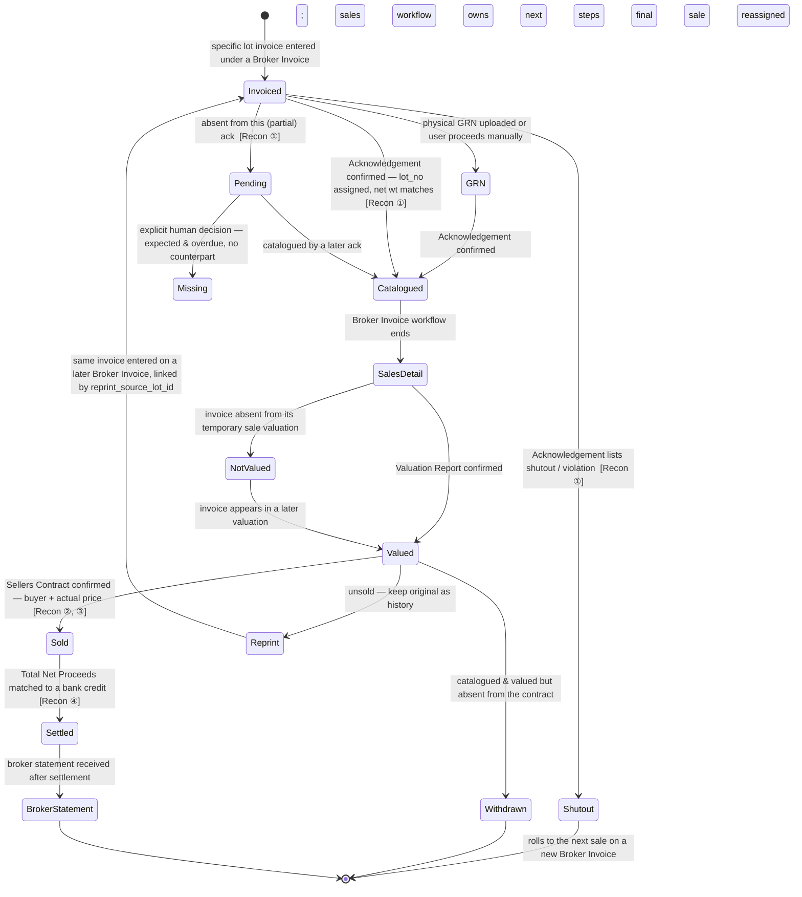

# Auction & Settlement — Feature Specification

> Canonical spec for the Colombo tea-auction flow (the A-track wedge). Written to
> be read by both humans and AI agents: every rule is concrete and enumerated,
> every formula has a worked example, and the invariants in §9 map 1:1 onto
> tests. If this file and the code ever disagree, treat the **invariants (§9)** as
> the contract and fix whichever side is wrong.
>
> **Scope now:** auction sales only, with clean separation from other money flows.
> Supplier payments and non-auction purchases are explicitly out of scope and slot
> in later via the `flow` tag (§5).
>
> **Source artifacts** (real customer data this spec is verified against):
> `~/Desktop/custo-tokanizer-onix/ktf-auc-fll/` — Sale `2026-023`, sold 17 Jun 2026,
> broker **BPML Produce Marketing**, seller **Kumudu Tea Factory**, marks
> `MF1530 KUMUDU` + `MF1530A ITTAPANA`. Files: `MF1530 Ack BPML 23.pdf`
> (Acknowledgement), `MF1530 Valuation BPML 23.pdf` (Valuation), `MF1530 Sellers
> Contract BPML 23.pdf` (Sellers Contract & Account Sales), `Bank Transaction
> Details.csv` (bank statement).

---

## 1. Glossary

| Term | Meaning |
|---|---|
| **Factory / Seller** | The tenant. Produces and invoices tea. (e.g. Kumudu Tea Factory) |
| **Broker** | The auction house that catalogues, values, sells, and settles on the factory's behalf. (e.g. BPML Produce Marketing) |
| **Mark / Estate mark** | A selling identity a factory trades under. One factory may have several. (e.g. `MF1530 KUMUDU`, `MF1530A ITTAPANA`) |
| **Buyer** | Exporter/trader who buys lots at auction. Has a VAT number. |
| **Sale** | A weekly auction event, identified by a **sale no.** (e.g. `2026-023`). |
| **Contract** | One settlement document per mark within a sale, identified by a **contract no.** (e.g. `2026/023/0110`). |
| **Broker invoice** | The factory's parent record for one broker and target sale. It groups the specific lot invoices sent to that broker. |
| **Dispatch (Bundled Invoice)** | The physical outbound dispatch. It bundles two or more confirmed Broker Invoices that share an invoice date and warehouse; lots remain owned by their original Broker Invoice. |
| **Lot** | A parcel of one grade offered as a unit — N bags × kg/bag. The central object; it moves through the state machine. |
| **Invoice no.** | The factory's own reference for a lot when it dispatches it (e.g. `0058`). |
| **Lot no.** | The catalogue number the broker assigns to a lot for the sale (e.g. `0477`). |
| **Grade** | Tea grade: OP, OP1, OPA, PEK, PEK1, BM, … |
| **Gross / Sample allowance / Net weight** | `net = gross − sample_allowance`. The sample allowance is tea drawn for tasting ("for viewing purpose only"); buyers pay on **net**. |
| **Valuation** | The broker's pre-sale estimate: a **price-per-kg range** + projected proceeds + a tasting note. |
| **Shutout / Violation** | A lot the factory invoiced that the broker did **not** catalogue for this sale (late arrival / over the storage norm). Stock stays at the warehouse and rolls to the next sale. |
| **Proceeds** | `net_kg × price_per_kg` — the hammer value of a lot before VAT and deductions. |
| **VAT** | 18%. Collected from the buyer **on the seller's behalf**; the factory remits it to the government. |
| **Bank Guarantee (YES/NO)** | Per sold lot. `NO` = buyer paid VAT up-front in **cash**. `YES` = VAT is **deferred**, secured by a bank guarantee, realised later. (Follow the document's column meaning — do not invert.) |
| **Account Sales / Settlement** | The broker's deduction stack applied to proceeds, yielding **Net Proceeds** and **Total Net Proceeds**. |
| **Prompt date** | The date the broker pays Total Net Proceeds to the factory's bank. |
| **Out-turn, grades** | Production-side concepts (deferred milestones M7/M8); the valuation tasting note is the future link to them. |

Valuation imports are broker-format aware. BPML uses the `Valuation Report`
layout with bags, kg/bag and tasting notes. ASIA SIYAKA uses the `VALUATION &
MUSTER REPORT` layout with selling-mark sections and columns ordered as lot,
invoice, grade, net weight, last-sale average, value/kg and value/lot. ASIA
SIYAKA reconciliation is keyed by normalized four-digit invoice number; its lot
number is retained for review but is not the primary join key.

Seller-contract imports are also broker-format aware. ASIA SIYAKA's `TEA
SELLERS CONTRACT & ACCOUNT SALES` may contain multiple contract/mark pages in
one PDF. Sold rows supply buyer and buyer VAT, lot/invoice, grade, bags,
gross/sample/net weights, price, proceeds, VAT, bank guarantee and proceeds plus
VAT. Rows labelled `*** NOT SOLD ***` are captured and shown in contract review.
On confirmation they automatically move the original lot to `re-print`, add one
more sampling cycle to cumulative `sample_allowance`, recalculate remaining net
weight from the original gross quantity, and write an audit-history record. They
must not create a `sale_lines` record. A later acknowledgement containing the
same invoice creates the linked `reprint_source_lot_id` child for the later sale,
where acknowledgement, valuation and seller-contract processing starts again.

---

## 2. Actors & the document chain

```
Factory ──invoice & dispatch──▶ Broker warehouse
Broker  ──Acknowledgement PDF──▶ Factory   (catalogues lots / lists shutouts)
Broker  ──Valuation PDF───────▶ Factory   (price range + tasting notes)
Broker  ──Sellers Contract PDF▶ Factory   (buyers, actual prices, VAT, deductions)
Broker  ──Total Net Proceeds──▶ Factory bank account (on prompt date)
Bank    ──statement CSV───────▶ Factory   (proof the cash arrived)
```

The three broker documents arrive **by email as PDFs with a clean text layer**
(parse directly, **no OCR**). The bank statement is a **CSV** downloaded from the
factory's bank.

**Broker-format guard (upload time).** Every broker document is uploaded against
a broker, so the PDF must be that broker's. `detectBrokerFormat` attributes the
file to a house using the same markers the parsers branch on — the trading name,
VAT number, or office address where present, and the layout alone where it is
not (the BPML acknowledgement names no house anywhere on the page). A file that
is demonstrably a different known house, or that matches no supported format, is
rejected with a message naming both, before anything is staged. Without this a
wrong-broker upload staged cleanly and surfaced much later as "N contract lines
could not be matched to a lot in this broker sale" — an invoice-matching error
for what is really a wrong-file mistake. A broker with no format registered here
is not blocked, since it cannot be checked either way.

---

## 3. Lifecycle & state transitions

A **lot** is the spine. Each document advances its state and asserts one
reconciliation.

> **Broker-invoice model.** The factory does **not** create a sale. It creates a
> **Broker Invoice** for one broker and target sale, then enters the specific lot
> invoices beneath it. Confirming the Broker Invoice moves the parent record from
> `draft` to `invoiced`. The user may then upload a physical GRN image/PDF or
> proceed manually through `grn`; parsing is intentionally deferred. The broker
> later catalogues a **subset** (acknowledgements are *partial*). Broker Invoice detail stops after acknowledgement at
> `catalogued`; valuation, sale, settlement, withdrawal, and re-print handling
> live in Sales Detail. Acknowledgement, valuation, and sellers contract documents
> are uploaded per sale and broker, then matched by invoice number across every
> Broker Invoice in that broker/sale group. A lot invoice absent from the *current*
> ack is `pending` (not an error — may roll forward), and an unsold lot
> becomes `re-print`. `missing` is only ever set by an explicit human decision in
> the orphan resolver, never by the reconciliation.


```mermaid
stateDiagram-v2
    [*] --> Invoiced: specific lot invoice entered under a Broker Invoice
    Invoiced --> GRN: physical GRN uploaded or user proceeds manually
    GRN --> Catalogued: Acknowledgement confirmed
    Invoiced --> Catalogued: Acknowledgement confirmed — lot_no assigned, net wt matches  [Recon ①]
    Invoiced --> Pending: absent from this (partial) ack  [Recon ①]
    Invoiced --> Shutout: Acknowledgement lists shutout / violation  [Recon ①]
    Pending --> Catalogued: catalogued by a later ack
    Pending --> Missing: explicit human decision — expected & overdue, no counterpart
    Catalogued --> SalesDetail: Broker Invoice workflow ends; sales workflow owns next steps
    SalesDetail --> Valued: Valuation Report confirmed
    SalesDetail --> NotValued: invoice absent from its temporary sale valuation
    NotValued --> Valued: invoice appears in a later valuation; final sale reassigned
    Valued --> Sold: Sellers Contract confirmed — buyer + actual price  [Recon ②, ③]
    Valued --> Reprint: unsold — keep original as history
    Valued --> Withdrawn: catalogued & valued but absent from the contract
    Sold --> Settled: Total Net Proceeds matched to a bank credit  [Recon ④]
    Settled --> BrokerStatement: broker statement received after settlement
    Reprint --> Invoiced: same invoice entered on a later Broker Invoice, linked by reprint_source_lot_id
    Shutout --> [*]: rolls to the next sale on a new Broker Invoice
    Withdrawn --> [*]
    BrokerStatement --> [*]
```

| From | To | Trigger (document) | Guard / assertion | Recon | Notes |
|---|---|---|---|---|---|
| — | `invoiced` | Factory action | invoice_no, grade, bags, kg/bag recorded | — | Specific lot invoice entered under a Broker Invoice; surface entry-time warnings such as below-minimum net kg |
| `invoiced` | `catalogued` | Acknowledgement | invoice_no found in catalogue; `net_wt` matches invoice | ① | `lot_no` assigned |
| `invoiced` | `shutout` | Acknowledgement | invoice_no found in shutout/violation section | ① | Records `shutout_reason`, net wt; un-realized stock |
| `catalogued` | `valued` | Valuation | lot_no found; `price_min ≤ price_max`; projected proceeds present | — | Tasting note stored |
| `catalogued` / `pending` | `not-valued` | Valuation (absence) | invoice was temporarily assigned to this sale but is absent from the broker valuation | — | Keeps its Broker Invoice parent and may appear in a later sale |
| `not-valued` | `valued` | Later valuation | invoice_no found in a later sale's report | — | `final_sale_no` changes to the report sale; old temporary sale is no longer the effective assignment |
| `valued` | `sold` | Sellers Contract | lot_no found; buyer resolved; `proceeds == round(net_wt × price_per_kg, 2)` | ②, ③ | Creates `sale_line` + VAT ledger entry |
| `valued` | `withdrawn` | Sellers Contract (absence) | lot catalogued/valued but no contract line | — | Unsold / withdrawn at auction |
| `valued` / `sold` / `withdrawn` | `re-print` | Owner action or Sellers Contract `NOT SOLD` | Original lot remains visible as history; contract-driven transition deducts one additional sample cycle | — | Later reuse of the same invoice is allowed only when the new lot links to this re-print source |
| `sold` | `settled` | Bank CSV | contract's Total Net Proceeds matched to a credit (full or ex-guarantee) | ④ | Guarantee-VAT may settle later |
| `settled` | `broker_statement` | Broker statement | Final broker statement received | — | Broker-invoice post-settlement stage |

The parent Broker Invoice has its own short lifecycle: `draft` → `invoiced` →
`grn` when the factory confirms it and handles the optional GRN, then
`catalogued` once acknowledgement processing
has advanced one or more of its lot invoices. The `invoiced` state on a lot is
unchanged: it remains the state of each specific invoice beneath the parent.

**Invariant:** a lot is in exactly one state. Allowed transitions are only those
above; anything else is a bug. Re-ingesting a document is idempotent (§6) and must
not move a lot backwards.

### Re-print chain history

Do not duplicate re-print history into a second table. Each appearance in a sale
is an `auction_lots` version linked to its preceding version through
`reprint_source_lot_id`. The root and descendants form the complete chain: sales
where it was re-printed, the later sale where it sold, cumulative sample
allowance, remaining net kg, and actual sold kg from `sale_lines`. A later ACK or
manual dispatch entry creates the child; valuation and contract processing apply
to that child in its own sale. Document-driven and manual state changes preserve
the same chain rules.

### Skipped sales

A lot dispatched to sale 15 is normally catalogued in sale 15. It is not
guaranteed: a broker can hold it and catalogue it in sale 20 instead, without
it ever being offered. That is **not** a re-print — nothing was offered and
left unsold — so it must not enter the re-print chain or its counts.

**`reprint` and `skipped_sale` are mutually exclusive**, decided by one
question about the origin lot: *was it actually offered to buyers in the sale
it sits in?* A valuation is the evidence — the broker only values what it put
up.

| origin lot | outcome |
|---|---|
| `unsold`, `valued`/`sold`, or already `reprint` | **re-print** — it faced buyers and did not sell |
| still `invoiced`/`acknowledged`, never valued | **skipped sale** — it never faced a buyer |

A lot is never both: it either went up for sale there or it did not. A re-print
leaves its origin row completely untouched — no `skipped_sale`, no
`skipped_sale_no` — because nothing was skipped.

The classification is made when the LATER sale's acknowledgement is confirmed,
which is the first moment the system learns where the lot resurfaced.

A skipped sale produces a pair of rows, permitted by
`uq_auction_lots_sale_invoice` (`sale_id`, `invoice_no`), the same compound key
the re-print chain relies on:

| | `state` | `skipped_sale` | `skipped_sale_no` | `reprint` |
|---|---|---|---|---|
| origin (sale 15) | `acknowledged` | `true` | `0020` | `false` |
| destination (sale 20) | `acknowledged` | `true` | *null* | `false` |

**Only the origin row carries a number, and that number is what removes it from
sale 15's figures.** `skipped_sale` with a `skipped_sale_no` means "left for a
later sale"; `skipped_sale` with no number means "arrived here" and counts
normally. Sale-detail totals apply that one predicate once, to the lot list
every figure derives from, and the sale-lines table offers a **Hide skipped
sales** toggle over the same flag.

The origin row is the point of the feature: before this it sat at `invoiced`
for ever, because recon ① only ever compared against the sale group under
review. It is now acknowledged where it stands, and `skipped_sale_no` records
where it actually surfaced. The destination row is flagged but carries no
number — it IS that sale. `reprint_source_lot_id` still links the two, so
"Previous sale" and lot history read the same as any other chain. `isReprintRow`
resolves the overlap: the stored `reprint` flag always wins, and only the
pre-flag `reprint_source_lot_id` fallback is suppressed when a skipped-sale
pair is what put that link there.

When the origin sale predates this system there is nothing to match, so the
row arrives as **Not invoiced**. **Register skipped sale** on the
reconciliation table asks for the dispatched sale number and creates the
missing origin row in it — the same shape the matcher would have found, so the
automatic and manual paths converge on identical data. It sits beside
**Register re-print** because only the operator knows which of the two
happened.

### Outstanding re-prints at cutover

At go-live a factory has re-prints outstanding from sales that happened before
this system existed, and historical invoices are **not** imported. Without a
record of them, the first acknowledgement listing one of those invoices has no
local counterpart: the row is acknowledged (the ack lists it) but carries
`invoiced: null`, indistinguishable from a broker cataloguing something the
factory never sent. Without the register there is no way to tell the two apart.

Such a re-print is entered on the **Re-prints** page (owner only) as a **real
lot**, through the ordinary lot-invoice path: same invoice numbering and prefix
resolution, same grade and kg/bag rules, same `auction_lots` row. It is created
under a real Broker Invoice and then moved straight to `re-print`. From that
point the normal chain applies — a later ACK matches it through the carry-forward
resolver and creates the linked `reprint_source_lot_id` child, and valuation,
contract and settlement run unchanged.

Deliberately **not** a separate `outstanding_reprints` table: that would create
a second matching mechanism to keep in step with carry-forward forever. The
register is the existing lot table, in the existing state.

**Recon ① reports the resolved answer, not the raw one.** `reconcileAcknowledgement`
compares only against the lots invoiced in the sale group under review, so a
carried-forward lot arrives with no `invoiced` side. The review screen resolves
those rows against the register before displaying them — as `re-print` or
`rolled forward` — and the confirm action calls the same resolver, so the
preview can never promise an outcome that confirmation does not perform.

**The operator sees exactly two results, one colour each: `catalogued` and
`not-acknowledged`.** `shutout`, `re-print` and `rolled forward` are internal
distinctions that surface in their own columns, never as a third badge; there
is no `unexpected` status anywhere in the UI. `not-acknowledged` on screen
means one thing: we invoiced it and this acknowledgement does not list it.

The Broker Invoice that holds these entries carries
`auction_sales.entry_source = 'reprint-register'` (ordinary invoices are
`'invoice'`). It is only provenance for the UI badge — nothing was physically
dispatched for it, so it is shown as `Re-print register` rather than reading as
a real dispatch. `entry_source` is part of the one-open-invoice-per
broker + mark + dispatch-date unique key, so a cutover entry never merges into
an open dispatch invoice. Matching still requires the **same broker**: a legacy
re-print catalogued by a different broker stays unresolved (acknowledged, but
still with no invoice of ours), because that is a genuine anomaly.

---

## 4. The four reconciliations (the product)

Each is a deterministic, testable calculation. Worked figures are from Sale 023.

### ① Invoice ↔ Acknowledgement
- **Answers:** did everything the factory invoiced get catalogued, at the right weight?
- **Inputs:** `lots` (state `invoiced`) vs the parsed Acknowledgement (catalogued + shutout rows).
- **Algorithm — one question, asked once:** *is this invoice in the acknowledgement?*
  - **yes** → `catalogued`, or `shutout` with the broker's reason if the document
    printed it under Shutout & Violation. Shutout is catalogued-with-a-reason, not
    a third outcome.
  - **no** → `not-acknowledged` (partial ack — may be catalogued later or roll to a
    later sale; **not** an error). `missing` is only set by an explicit human
    decision in the orphan resolver.

  Nothing else changes the status. Whether we ALSO hold an invoice for an
  acknowledged line is not a classification — it shows as `invoiced: null` on the
  row, and drives carry-forward, re-print registration and the orphan resolver.
  When we do hold one, the row additionally carries a weight delta and grade check.
- **Orphan resolver:** the ambiguous rows (`not-acknowledged` invoiced lots ↔ acknowledged
  catalogue lots) are reconciled manually in a **Compare** panel: candidates are
  ranked by a transparent per-dimension score (grade family, Δkg, lot proximity),
  nothing auto-links, and every link/mark is written to `auction_audit` with the
  filed Δkg. Same pattern reused for recon ④ (unattributed credit ↔ unpaid
  settlement, scored on amount / date / narration).
- **Outputs / flags:** `catalogued`, `shutout`, `not-acknowledged`, `weight_mismatch`.
- **Sale 023:** 12 lots catalogued (11 under `MF1530`, 1 under `MF1530A`); invoices **`0061`** (OPA, 200 kg) and **`0063`** (OPA, 230 kg) shut out → 430 kg of stock rolls to the next sale.

### ② Valuation ↔ Sale price
- **Answers:** how did the hammer price compare to the broker's estimate?
- **Inputs:** `valuations` (`price_min`, `price_max`) vs `sale_lines` (`price_per_kg`).
- **Algorithm (per lot):**
  - `price_per_kg < price_min` → **below**
  - `price_min ≤ price_per_kg ≤ price_max` → **within**
  - `price_per_kg > price_max` → **above**
  - `variance = proceeds − projected_proceeds` (projected uses **low end × net_wt**).
- **Aggregate:** realised avg vs valuation avg, per grade and per sale.
- **Sale 023:** 10 of 11 lots **above** range, 1 at point; valuation avg **1,518.35/kg → sold 1,656.70/kg (+9.1%)**; projected ≈ 4.51M → actual **4,920,400** (+~410K). Tasting notes (e.g. "Grayish, mixed with short particles") are retained for the future grades link.

### ③ VAT split & remittance
- **Answers:** how much VAT is cash-in-hand vs secured on guarantee, and what's owed to government?
- **Inputs:** `sale_lines` (`vat_amount`, `on_guarantee`), `broker_rates` (charges VAT), `vat_ledger`.
- **Algorithm:**
  - per line: `vat_amount = round(proceeds × 0.18, 2)`; `mode = on_guarantee ? guarantee : cash`.
  - `cash_vat = Σ vat_amount where mode = cash`; `guaranteed_vat = Σ vat_amount where mode = guarantee`.
  - `output_vat = cash_vat + guaranteed_vat` (auction flow).
  - `input_vat = Σ broker charges-VAT` (the broker's VAT on its own fees — auction input VAT).
  - `net_vat_payable = output_vat − input_vat`.
  - Track guarantee realisation dates; flag overdue guarantees.
- **Sale 023 (both contracts):** `output_vat = 885,672 + 46,440 = 932,112`; guaranteed `166,860` (lots **`0481`** STASSEN 83,700 + **`0670`** EMPIRE 83,160), cash `765,252`; `input_vat = 11,026.15 + 681.28 = 11,707.43`; `net_vat_payable = 920,404.57`.
  - *Cash-basis vs accrual remittance timing is a tax-policy question for the factory's accountant; the ledger carries both the accrued liability and the cash position so either basis is reportable.*

### ④ Settlement ↔ Bank
- **Answers:** did the money actually arrive, and does it match the contract?
- **Inputs:** `settlements.total_net_proceeds` + `prompt_date` vs `bank_txns.credit`.
- **Algorithm (tolerant — broker VAT-remittance timing is not yet confirmed):** around the prompt date, try to match a credit to **either**
  - `total_net_proceeds` (full VAT included) → label **`full`**, or
  - `total_net_proceeds − guaranteed_vat` (cash VAT only) → label **`cash_only` (guarantee pending)**.
  Within a date window and amount tolerance; mark `matched` / `partial` / `unmatched`. Cheque reconciliation matches `bank_txns.cheque_no` to expected cheques.
- **Sale 023:** expected `5,733,046.98` (KUMUDU) + `299,898.85` (ITTAPANA) = **6,032,945.83**, due **24 Jun**. The sample statement ends **22 Jun** → recon ④ correctly reports **expected, not yet received (statement predates prompt date)**. Ex-guarantee fallback for KUMUDU = `5,733,046.98 − 166,860 = 5,566,186.98`.

---

## 5. Data model

**Conventions (apply to every table):** UUID primary key, **client-generated** so
records can originate offline; `factory_id uuid NOT NULL` + index; `created_at`,
`updated_at`; an RLS `factory_isolation` policy (`USING factory_id =
current_factory_id()` + matching `WITH CHECK`) created **in the same migration**.
**All money and weight columns are `numeric`, never `real`.** Entitlement key:
`auction` (A1–A3), `accounts` (A4).

**Naming:** auction transaction tables that would collide with or be ambiguous
against the deferred production tables are prefixed `auction_` (`auction_sales`,
`auction_lots`) — the repo already has a production `lots` table (graded tea,
referenced by `weighings`). Registry tables (`brokers`, `marks`, `buyers`) are
unprefixed. `auction_lots.grade` is **free-form text** (broker catalogue grades
vary), not the `tea_grade` enum.

```
brokers           id, factory_id, name, vat_no, address
broker_rates      id, factory_id, broker_id, effective_from(date),
                  insurance_per_kg, public_sale_ex_per_lot, brokerage_pct,
                  handling_per_kg, documentation_per_lot, eplatform_per_kg,
                  govt_relief_loan, charges_vat_pct(=18), proceeds_vat_pct(=18)
                  -- owner-editable, PER BROKER, effective-dated. Never hardcoded.
marks             id, factory_id, code, name, address          -- MF1530 KUMUDU
buyers            id, factory_id, name, vat_no
auction_sales     id, factory_id, broker_id, sale_no, created_date(server-generated),
                  sale_date, prompt_date, status                  -- one row per (broker, sale_no)
auction_lots      id, factory_id, sale_id, mark_id, invoice_no,
                  provisional_sale_no, final_sale_no, lot_no, grade(text),
                  bags(int), kg_per_bag, gross_wt, sample_allowance, net_wt,
                  store, category, state, shutout_reason
                  -- invoice_no is the denormalized PRIMARY; lot_invoices is the
                  --   source of truth (a lot rarely carries >1 invoice). lot_no is
                  --   optional at dispatch (usually assigned at cataloguing).
                  -- state ∈ invoiced|acknowledged|pending|missing|shutout|not-valued|valued|
                  --         sold|re-print|withdrawn|settled
lot_invoices      id, factory_id, lot_id, invoice_no       -- 1 lot → 1..n invoices
auction_audit     id, factory_id, sale_id?, lot_id?, action, detail, reason, actor,
                  confidence_shown, weight_delta, created_at
                  -- every MANUAL recon decision (orphan link/mark, bank link) — the
                  --   filed Δkg on a link lives in weight_delta so it isn't lost
valuations        id, factory_id, lot_id, price_min, price_max,
                  projected_proceeds, tasting_note, valued_at
sale_lines        id, factory_id, sale_id, lot_id, buyer_id, gross_wt,
                  sample_allowance, net_wt, price_per_kg, proceeds, vat_amount,
                  on_guarantee(bool), proceeds_with_vat
settlements       id, factory_id, sale_id, contract_no, proceeds_total,
                  total_deductions, net_proceeds, output_vat, total_net_proceeds,
                  prompt_date
settlement_charges id, factory_id, settlement_id, code, label, basis, rate, amount
                  -- one row per deduction line (insurance, public_sale_ex,
                  --   brokerage, handling, documentation, charges_vat,
                  --   govt_relief_loan, eplatform). basis ∈ per_kg|per_lot|pct|flat
vat_ledger        id, factory_id, sale_line_id, flow, vat_amount, mode,
                  realised_date, guarantee_due_date, status
                  -- flow ∈ auction_output|auction_input  (room for future flows)
                  -- mode ∈ cash|guarantee ; status ∈ received|pending|remitted
bank_txns         id, factory_id, txn_date, description, debit, credit,
                  running_balance, cheque_no, raw_line, import_batch_id,
                  matched_settlement_id, match_status
doc_imports       id, factory_id, doc_type, source_filename, storage_path,
                  content_hash, parsed_json, status, parsed_at, confirmed_at
                  -- doc_type ∈ grn|acknowledgement|valuation|contract|bank_csv
                  -- status ∈ parsed|reviewed|confirmed|rejected
```

**Relationships:** `sales 1─*  lots 1─1 valuations`, `lots 1─0..1 sale_lines`,
`sales 1─* settlements 1─* settlement_charges`, `sale_lines 1─1 vat_ledger`,
`settlements 0..1─* bank_txns` (via matching). The `flow` tag on `vat_ledger` is
the seam that keeps auction VAT separate from later flows.

---

## 6. PDF / CSV ingestion design

**Pattern (every document type):** `parse → staging → review → confirm`.

1. **Receive** the file (broker PDF or bank CSV).
2. **Detect type** by header markers:
   - "Acknowledgement" → `acknowledgement`
   - "Valuation Report" → `valuation`
   - "TEA SELLERS CONTRACT & ACCOUNT SALES" → `contract`
   - CSV with bank columns → `bank_csv`
3. **Parse** with the type's parser (a pure `text → structured rows` function, one
   per doc type, isolated so a second broker's layout is an *additive* parser, never
   a rewrite). PDFs have a text layer → extract text directly, **no OCR**.
4. **Self-check** before allowing confirm — parse-integrity gates:
   - sum of parsed lot proceeds == the document's printed proceeds total;
   - parsed totals (net kg, lot count, VAT, total net proceeds) == printed totals;
   - recompute the contract math (§7) from `broker_rates` and compare to parsed
     deductions (flag drift, don't silently overwrite).
5. **Write to staging** (`doc_imports.parsed_json`, status `parsed`).
6. **Review screen** — side-by-side parsed values vs raw text, with the relevant
   reconciliation pre-computed so the reviewer sees mismatches before confirming.
7. **Confirm** → commit to domain tables and advance lot states. **Reject** →
   discard staging row; nothing touches domain tables.

**Idempotency:** dedupe on `content_hash` (+ `doc_type` + `sale_no`/`contract_no`).
Re-ingesting the same email is a no-op; a corrected re-import re-parses, diffs
against existing rows, and updates — never double-writes, never moves a lot
backwards. A mis-parse can therefore never write silently: it surfaces as a review
diff or a failed self-check.

---

## 7. Contract math (Account Sales)

Per contract, given `net_kg`, `lots` (count), `proceeds` (Σ sale-line proceeds),
and the broker's effective `broker_rates`. All steps round **half-up to 2 dp**.

```
insurance       = round(net_kg  × insurance_per_kg,       2)
public_sale_ex  = round(lots     × public_sale_ex_per_lot, 2)
brokerage       = round(proceeds × brokerage_pct,          2)
handling        = round(net_kg  × handling_per_kg,         2)
documentation   = round(lots     × documentation_per_lot,  2)
charges_subtotal= insurance + public_sale_ex + brokerage + handling + documentation
charges_vat     = round(charges_subtotal × charges_vat_pct, 2)      -- 18%, broker's VAT on its fees
eplatform       = round(net_kg × eplatform_per_kg, 2)
govt_relief_loan= (per broker; 0 in Sale 023)
total_deductions= charges_subtotal + charges_vat + govt_relief_loan + eplatform
net_proceeds    = proceeds − total_deductions
output_vat      = round(proceeds × proceeds_vat_pct, 2)             -- 18%, collected from buyers on seller's behalf
total_net_proceeds = net_proceeds + output_vat                     -- what the broker pays the factory
```

**Per sale line:** `net_wt = gross_wt − sample_allowance`;
`proceeds = round(net_wt × price_per_kg, 2)`;
`vat_amount = round(proceeds × 0.18, 2)`;
`proceeds_with_vat = proceeds + vat_amount`.

**BPML rate card (Sale 023):** insurance `0.06/kg`, public sale ex. `87.87/lot`,
brokerage `1.00%`, handling `3.58/kg`, documentation `25.00/lot`, e-platform
`0.25/kg`, govt relief loan `0`, VAT `18%`.

### Worked example — Sale 023, reproduced to the cent

| Line | `MF1530 KUMUDU` (0110) | `MF1530A ITTAPANA` (0111) |
|---|--:|--:|
| Net kg / lots | 2,970.00 / 11 | 300.00 / 1 |
| Proceeds | 4,920,400.00 | 258,000.00 |
| 1 Insurance (0.06/kg) | 178.20 | 18.00 |
| 2 Public sale ex. (87.87/lot) | 966.57 | 87.87 |
| 3 Brokerage (1%) | 49,204.00 | 2,580.00 |
| 4 Handling (3.58/kg) | 10,632.60 | 1,074.00 |
| 5 Documentation (25/lot) | 275.00 | 25.00 |
| VAT 18% on 1–5 | 11,026.15 | 681.28 |
| e-Platform (0.25/kg) | 742.50 | 75.00 |
| **Total deductions** | **73,025.02** | **4,541.15** |
| **Net proceeds** | **4,847,374.98** | **253,458.85** |
| Output VAT (18%) | 885,672.00 | 46,440.00 |
| **Total net proceeds** | **5,733,046.98** | **299,898.85** |

Combined Total Net Proceeds = **6,032,945.83**, due on prompt date **24 Jun 2026**.

---

## 8. Worked sale-line examples (Sale 023, KUMUDU)

| Lot | Inv | Grade | Bags×kg | Gross | S/Allw | Net | Price/kg | Proceeds | VAT | Guarantee | Valuation | vs range |
|---|---|---|---|--:|--:|--:|--:|--:|--:|---|---|---|
| 0477 | 0058 | OP | 10×28 | 282.50 | 2.50 | 280.00 | 1,600 | 448,000 | 80,640 | NO | 1600 | within |
| 0478 | 0059 | OP | 10×24 | 242.50 | 2.50 | 240.00 | 1,500 | 360,000 | 64,800 | NO | 1350–1400 | above |
| 0480 | 0038 | OP1 | 10×26 | 262.50 | 2.50 | 260.00 | 2,350 | 611,000 | 109,980 | NO | 2000–2100 | above |
| 0481 | 0066 | OP1 | 10×30 | 302.50 | 2.50 | 300.00 | 1,550 | 465,000 | 83,700 | **YES** | 1450–1500 | above |
| 0670 | 0065 | PEK | 10×28 | 283.50 | 3.50 | 280.00 | 1,650 | 462,000 | 83,160 | **YES** | 1450–1500 | above |
| 0766 | 0044 | PEK1 | 10×34 | 343.50 | 3.50 | 340.00 | 2,050 | 697,000 | 125,460 | NO | 1900–1950 | above |

(Sample allowance is `0.25/bag` for OP/OP1/OPA and `0.35/bag` for PEK/PEK1/BM.)

---

## 9. Invariants & test assertions

Machine-checkable rules. Each becomes a fixture/unit test against Sale 023.

1. **Weight:** `net_wt == gross_wt − sample_allowance` (every lot & sale line).
2. **Proceeds:** `proceeds == round(net_wt × price_per_kg, 2)` (every sale line).
3. **Line VAT:** `vat_amount == round(proceeds × 0.18, 2)`.
4. **Catalogue tie:** `Σ sale_lines.proceeds == settlement.proceeds_total` per contract.
5. **Deductions:** each `settlement_charges.amount` equals its §7 formula from the
   effective `broker_rates`; `total_deductions == Σ charges`.
6. **Settlement:** `net_proceeds == proceeds_total − total_deductions`;
   `total_net_proceeds == net_proceeds + output_vat`.
7. **VAT split:** `output_vat == cash_vat + guaranteed_vat`;
   `guaranteed_vat == Σ vat_amount where on_guarantee`.
8. **Recon ① conservation:** every `invoiced` lot ends `catalogued` or `shutout`
   (or `missing`, flagged); `Σ catalogued.net_wt == printed catalogued total`.
9. **State machine:** only §3 transitions occur; ingestion never moves a lot backward.
10. **Sale 023 golden numbers:** KUMUDU TNP `5,733,046.98`; ITTAPANA TNP
    `299,898.85`; guaranteed VAT `166,860`; cash VAT `765,252`; net VAT payable
    `920,404.57`; shutouts `0061` + `0063` (430 kg).

---

## 10. Open items & assumptions

1. **Broker VAT-remittance timing (recon ④)** — unconfirmed whether the broker
   pays full VAT (incl. guaranteed lots) at prompt date or only cash VAT with the
   rest later. Sample bank statement predates the prompt date, so unobserved.
   **Handled by design:** recon ④ matches either amount and labels it; the first
   observed settlement confirms the broker's real behaviour, then we lock it in.
2. **Deduction rates** — owner-editable **per-broker** rate cards (effective-dated).
   Reconstruction uses configured rates and cross-checks against the parsed
   contract, flagging drift.
3. **VAT scope** — auction flow only for now (output VAT split cash/guarantee +
   broker charges-VAT as auction input VAT). Other flows (supplier payments,
   non-auction purchases) are out of scope; the `vat_ledger.flow` tag lets them
   join later as separate buckets so the government return sums across flows
   deliberately.

---

## Build sequence

See **[MILESTONES.md](../MILESTONES.md)** A-track: **A1** intake & cataloguing
(recon ①) → **A2** valuation & sale (recon ②) → **A3** VAT/deductions/settlement
(recon ③) → **A4** accounting + bank/cheque reconciliation (recon ④, Priority 2).
Domain context lives in **[PRODUCT.md](PRODUCT.md)** ("The Colombo auction &
settlement flow").
